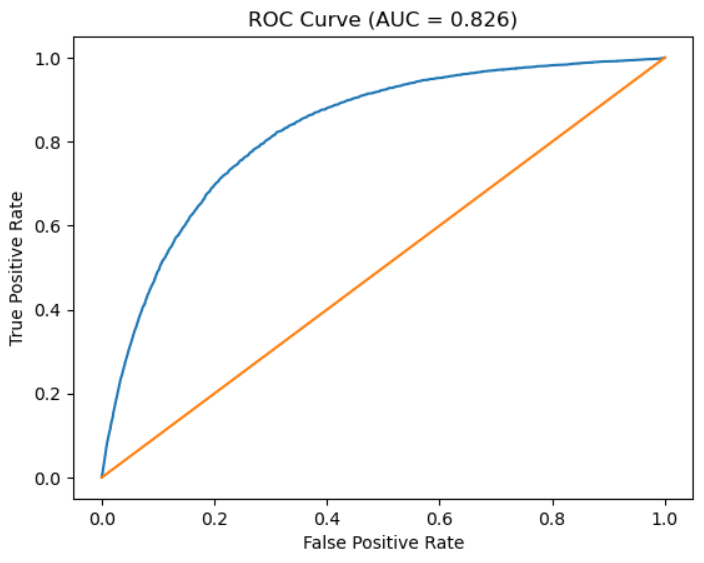

# 🦠 COVID-19 Mortality Risk Prediction  
### An Interpretable Machine Learning Approach Using Patient Demographics and Medical History

---

## 📌 Project Overview

The goal of this project is to build a **machine learning model** that predicts whether a COVID-19 patient is **high risk** or **low risk**, using only information that is available **early in the patient’s clinical timeline**.  
In this project, **high risk** is explicitly defined as **mortality**.

The model relies on:
- Basic demographic information (age, sex, pregnancy status)
- Pre-existing medical conditions (e.g., diabetes, cardiovascular disease, renal disease)

The focus of this project is **early risk stratification**, not clinical diagnosis or treatment.

---

## 🎯 Problem Definition

Healthcare systems often need to assess patient risk **before** severe outcomes occur.  
This project answers the following question:

> *Given a COVID-19 patient’s demographic information and medical history, can we estimate whether the patient is at high risk of death?*

This was formulated as a **binary classification problem**:
- `DEATH = 1` → Patient died (high risk)
- `DEATH = 0` → Patient survived (low risk)

---

## 🗂 Dataset Description

- **Source:** [Public COVID-19](https://www.kaggle.com/datasets/meirnizri/covid19-dataset) dataset from Kaggle
- **Size:** ~1 million anonymized patient records  
- **Features:** Demographics, comorbidities, hospitalization indicators, and outcomes  

### Key Data Characteristics
- Binary medical variables encoded as `1 = Yes`, `2 = No`
- Missing values encoded as `97` and `99`
- Survival encoded as `DATE_DIED = 9999-99-99`

---

## 🧹 Data Cleaning & Preparation

A major part of this project involved **responsible data preparation**, which is especially critical in healthcare analytics.

### Steps Performed

#### 1. Outcome Definition
- Created a binary target variable `DEATH`
- Converted survival indicators into `DEATH = 0`

#### 2. Leakage Prevention
To avoid unrealistic predictions, variables that occur **after disease progression** were removed, including:
- ICU admission
- Intubation
- Pneumonia
- Patient type (hospitalized vs discharged)

This ensures the model does **not use future information**.

#### 3. Handling Missing Values
- Categorical medical and demographic variables: missing values → `"Unknown"`
- Age: records with missing age were removed (age is a critical predictor)

#### 4. Population Filtering
- Dataset restricted to **confirmed COVID-19 cases only**

---

## 🔄 Feature Engineering & Encoding

### Categorical Variables
- Encoded using **one-hot (dummy) encoding**
- One category per variable is treated as a **reference group**
- All coefficients are interpreted relative to this baseline

### Continuous Variables
- **Age was kept numeric**
- This avoids unnecessary dimensionality and ensures model stability

This separation between categorical and numeric variables was essential for proper model convergence and interpretation.

---

## 🧪 Cross-Validation Strategy

To evaluate real-world performance, the data was split into:
- **80% Training set**
- **20% Validation set**

The split was **stratified by the outcome (`DEATH`)**, ensuring similar class proportions in both sets.

This guarantees that all reported metrics reflect **out-of-sample performance**.

---

## 📐 Model Choice: Logistic Regression

### Why Logistic Regression?

- Binary outcome (death vs survival)
- Outputs **probabilities**, not just class labels
- Highly interpretable coefficients
- Widely used in epidemiology and medical research

The model estimates the probability that a patient dies given their age, sex, and medical history:

P(DEATH = 1 | Age, Sex, Medical History)

---

## 📊 Model Evaluation & Results

### Confusion Matrix
The confusion matrix was used to examine:
- True Positives (correctly identified deaths)
- False Negatives (missed high-risk patients)
- False Positives (false alarms)
- True Negatives (correctly identified survivors)

In this context, **false negatives are the most critical error**, as they represent high-risk patients that were not identified.

---

### Performance Metrics

- **Accuracy:** Overall proportion of correct predictions  
- **Recall (Sensitivity):**  
  Proportion of actual deaths correctly identified  
  → **Most important metric for healthcare risk modeling**
- **Precision:**  
  Proportion of predicted high-risk patients who actually died  

Threshold analysis (e.g., 0.3–0.6) was conducted to explore trade-offs between recall and precision.

---

### ROC Curve & AUC

- **ROC Curve:** Visualizes performance across all possible probability thresholds
- **AUC (Area Under the Curve):** Measures the model’s ability to distinguish high-risk patients from low-risk patients

An AUC significantly greater than 0.5 indicates the model performs **substantially better than random guessing**, even without lab values or imaging data.

---

## 📈 Model Interpretability: Odds Ratios

Logistic regression coefficients were converted into **odds ratios** to support interpretation:

- **Odds Ratio > 1:** Increased mortality risk
- **Odds Ratio < 1:** Decreased mortality risk

### Key Findings
- **Age** is the strongest predictor of mortality
- Comorbidities such as:
  - Diabetes
  - Cardiovascular disease
  - Chronic renal disease  
  significantly increase the odds of death
- Male sex is associated with higher mortality risk

All major findings are **clinically plausible** and consistent with existing COVID-19 research.

---

## 🧠 Final Interpretation

This project demonstrates that:
- A carefully designed, interpretable machine learning model can meaningfully estimate COVID-19 mortality risk
- Demographics and medical history alone provide substantial predictive signal
- Logistic regression balances **predictive performance** with **interpretability**
- Evaluation using recall, ROC-AUC, and cross-validation ensures robust conclusions

This model is intended for **early risk stratification**, not direct clinical decision-making.

---

## ⚠️ Limitations

- No laboratory values, vital signs, or imaging data
- Observational dataset (no causal claims)
- Missing values encoded as `"Unknown"` may obscure some nuance

---

## 🚀 Future Improvements

- Incorporate lab results and vital signs
- Compare performance with regularized or tree-based models
- Perform fairness analysis across demographic groups
- Calibrate predicted probabilities for deployment scenarios
